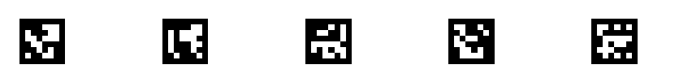
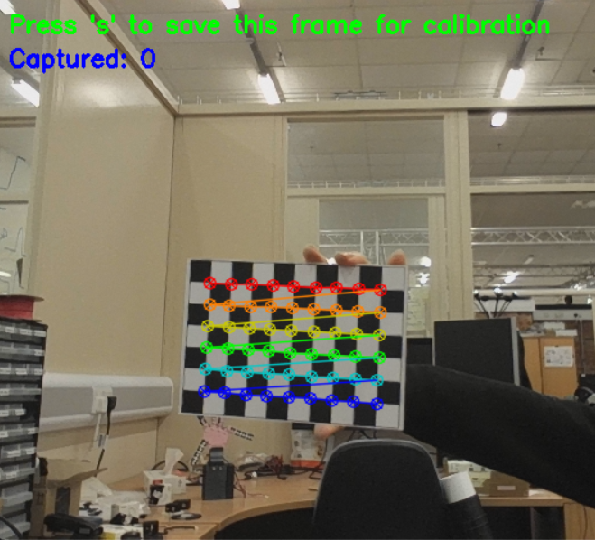

## Aruco marker Detectors 
In order to detect relative positions of the finger joints you can easily use aruco markers.
Currently this is configured to only produce relative joint angles. However, it can be changed to give 3d position and angle vectors.
This may be important for working out end effector position from the joint angles, however it is recomended to **implement using forwards kinematics** on your known angles based on your own geometry.
    -  this is only because it will be difficult to stick the markers on the exact tip point of the end effector and the exact base point of the first joint. 
### Marker set up
in 'Aruco>Marker Maker>' you will find two python files 'marker maker.py' and 'chessboard maker.py' these files only need to be edited if the you need new / custom markers, otherwise they can remain untouched
- if editing the chess board, sides must be irregular, i.e one side has an od number of squares, and the other has even.
- if editing the above or dictionary of the aruco markers, the 'aruco detector.py' file must be updated to match these changes

The only file of interest is 'marker printer.html' editing this file will let you easily alter dimensions of the printed markers and chessboard
Running this file in your browser allows you to instantly print it to scale.



Glue the chessboard to a flat plate for camera calibration

### camera set up
To calibrate your camera, in a well lit environment, run Aruco > camera calibrator.py 
possitioning the chessboard completely inframe and uncovered should cause the program to draw markers on the board.



Then, using the s key take 15-25 shots of the checker board at different locations & rotations around the frame

once collected press c to save this data to calibration.npz
and press q to quit the program

### angle tracking
'Aruco>aruco detector.py' can be used in 2 ways:
- directly running it; which will by default run in continuous mode showing videos and debug text,
- and calling the main function using:   
```python 
from arucoDetector import GetCameraData, GetMarkerAngle, CleanupCamera
```

running the program from import allows headless running and 'instance' marker angle aquisition; meaning you call the function once and it gives you one set of angles as the output for that instance.
you can set the expected number of markers to find, the max number of iterations where it will try to get these angles, and the amount of iterations it will need to get all angles for averaging results. If it gets more than 3 angles it will use median absolute deviation outlier removal to get the closest posible value

This function is fully blocking, and based on the maxIterations & averagingIterations can take 1-2 seconds to compute
so if using it for motor position control use it with maxIterations=10 averagingIterations = 2 or other low numbers to minimise processing time and just call the function a lot.

all of the editable variables for the arucoDetector:
```python
cameraID:int                    = 0        # id of camera
markerSize:float                = 0.02     # size of the markers in meters (0.025 = 25mm)
expectedNumber:int              = 4        # expected number of markers to find
maxIterations:int               =100       # maximum number of frames it will attempt to find markers (only used if program not running in continuous mode)
averagingItertions:int          =15        # the amount of frames it will try to average the angle over (values over 3 enable std based outlier removal)
OutlierRejectionThreshold:float = 0.8      # how strictly to reject outliers when > 3 averageing frames have been found (lower is harsher)
ParralellToCamera               = False    # is marker parralel to camera (non paralell use 3d rotation matries which take more processing)
continuous:bool                 = True     # run the detection indefinitely
showVideo:bool                  = True     # show the video frame
debugInfo:bool                  = False    # output text
calibrationFilePath:str         = 'calibration.npz' # location of camera calibrator
```
An example use of the detector:
```python
from ArucoDetector import GetMarkerAngle, GetCameraData, CleanupCamera
# set up camera
GotData,CameraData = GetCameraData(cameraID =0)
if GotData:
    for x in range (1):
        # run program in headless mode looking for 4 markers trying to get 15 values for each angle to average over 
        GotAngles,angles = GetMarkerAngle(CameraData,5, maxIterations=100, averagingItertions=15) 
        if GotAngles:
            #process angles
           for i in range(len(angles)):
               print(f"Angle between marker {i} & {i+1}: {angles[i]} degrees")
        else:
            print("No markers detected.")
        print("#################################")
CleanupCamera(CameraData)
```

